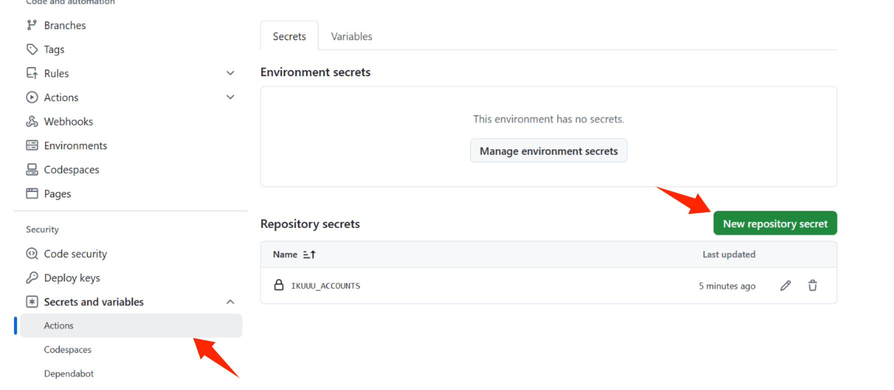
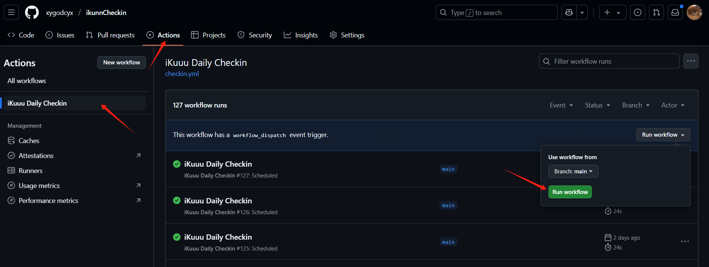

# 怎么使用 ikunnCheckin

## 1.fork此项目

## 2.配置仓库变量
### 在setting设置里找到Secrets and variables下的 Actions

### 格式
  **密钥名为：IKUUU_ACCOUNTS** (注意此数据结构为json,请不要尾随逗号,为确保格式正确请在ide里书写好json数据再复制到此处)
  ```json
  [
    { "email": "your_email_1","password": "your_password_1" },
    { "email": "your_email_2","password": "your_password_2" }
    // ...
  ]
  ```
### 配置完毕后记得首次启动一下action


## 愉快的使用‘坐享其成’吧
