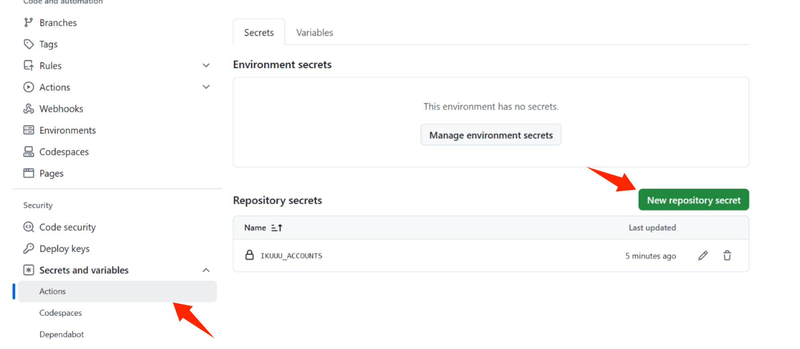

# 怎么使用 ikunnCheckin

## 1.fork此项目

## 2.配置环境变量


### 格式
  **密钥名为：IKUUU_ACCOUNTS** 
  ```json
  [
    { "email": "your_email_1","password": "your_password_1" },
    { "email": "your_email_2","password": "your_password_2" },
    // ...
  ]
  ```

## 愉快的使用‘坐享其成’吧
